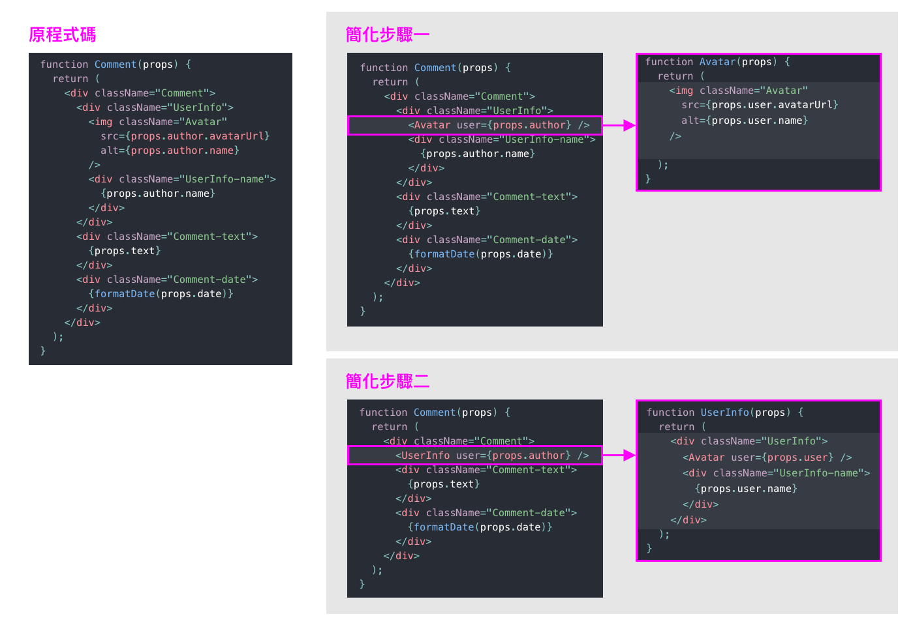

# React 學習

[教學來源：React 中文教學](https://zh-hant.reactjs.org/docs/add-react-to-a-website.html)

---

- [React 學習](#react-學習)
  - [使用 React - CDN](#使用-react---cdn)
  - [使用 JSX](#使用-jsx)
    - [方法一：使用 CDN](#方法一使用-cdn)
  - [Components 與 Props](#components-與-props)
    - [定義 component 的方法](#定義-component-的方法)
      - [方法一：Function Component](#方法一function-component)
      - [方法二：Class Component](#方法二class-component)
  - [Render 一個 Component](#render-一個-component)
    - [範例一：相當於 DOM 標籤的 React element：](#範例一相當於-dom-標籤的-react-element)
  - [使用者自定義的 component](#使用者自定義的-component)
  - [組合 Component](#組合-component)
  - [抽離 Component](#抽離-component)


---

## 使用 React - CDN

以下的版本只適用於開發環境，並不適合用於線上環境：

```html
<script crossorigin src="https://unpkg.com/react@16/umd/react.development.js"></script>
<script crossorigin src="https://unpkg.com/react-dom@16/umd/react-dom.development.js"></script>
```

以下為已壓縮和最佳化的版本：

```html
<script crossorigin src="https://unpkg.com/react@16/umd/react.production.min.js"></script>
<script crossorigin src="https://unpkg.com/react-dom@16/umd/react-dom.production.min.js"></script>
```

更改版本號碼 16 來載入指定版本的 react 和 react-dom。

---

## 使用 JSX

### 方法一：使用 CDN

```js**
<script src="https://unpkg.com/babel-standalone@6/babel.min.js"></script>
```

在任何使用 JSX 語法的 `<script>` 標籤內加上 `type="text/babel"` attribute 。

### 方法二：使用 JSX Preprocessor
[[ 傳送門 ↗ ]](https://zh-hant.reactjs.org/docs/add-react-to-a-website.html#optional-try-react-with-jsx)

第一步： 執行 `npm init -y`

第二步： 執行 `npm install babel-cli@6 babel-preset-react-app@3`

第三步： 建立一個名為 *src* 的文件夾，然後執行這個終端指令：

`npx babel --watch src --out-dir . --presets react-app/prod`

JSX 使用介紹請參考：[JSX 介紹](jsx.md)

---

## 受歡迎的 React toolchain

[[ 傳送門 ↗ ]](https://zh-hant.reactjs.org/docs/create-a-new-react-app.html)

- 如果你正在學習 React 或建立全新的 single-page 應用程式，請使用 **Create React App**。
- 如果你正在建立一個使用 Node.js 的 server-rendered 網頁，請使用 **Next.js**。
- 如果你正在建立一個靜態內容的網頁，請使用 **Gatsby**。
- 如果你正在建立一個 component 函式庫或與現存程式碼倉庫進行接軌，請使用更靈活的 **Toolchain**。

---

## React Developer Tools

[[ 傳送門 ↗ ]](https://reactjs.org/blog/2015/09/02/new-react-developer-tools.html#installation)


---

## Element

一個 element 描述你想要在螢幕上所看到的：

```js
const element = <h1>Hello, world</h1>;
```

- 建立 React 應用程式最小的單位是 **element**。
- React element 是不可變的。一旦你建立一個 element，你不能改變它的 children 或是 attribute。
- Element 就像是電影中的一個影格：它代表特定時間點的 UI。
- React DOM 會將 element 和它的 children 與先前的狀態做比較，並且只更新必要的 DOM 達到理想的狀態。

---

## Components 與 Props

> [Components 詳細的 API 文件](https://zh-hant.reactjs.org/docs/react-component.html)

**概念上來說，component 就像是 JavaScript 的 function，它接收任意的參數（稱之為「props」）並且回傳描述畫面的 React element。**

### 定義 component 的方法

#### 方法一：Function Component 

```js
function Welcome(props) {
  return <h1>Hello, {props.name}</h1>;
}
```

上列 function 是一個符合規範的 React component，因為**它接受一個「props」**（指屬性 properties）物件並**回傳一個 React element**。


#### 方法二：Class Component 

```js
class Welcome extends React.Component {
  render() {
    return <h1>Hello, {this.props.name}</h1>;
  }
}
```

---

## Render 一個 Component

### 範例一：相當於 DOM 標籤的 React element：

```js
const element = <div />;
```

## 使用者自定義的 component

```js
function Welcome(props) {
  return <h1>Hello, {props.name}</h1>;
}

const element = <Welcome name="Sara" />;
ReactDOM.render(
  element,
  document.getElementById('root')
);
```
- 我們對 `<Welcome name="Sara" />` 這個 `element 呼叫了 ReactDOM.render()`。
- React 以 `{name: 'Sara'}` 作為 props 傳入 `Welcome` component 並呼叫。
- `Welcome` component 回傳了 `\<h1>Hello, Sara</h1>` 這個 element 作為返回值。
- React DOM 有效的將 DOM 更新為 `\<h1>Hello, Sara</h1>`。

> 注意： Component 的字首須為大寫字母

## 組合 Component

Component 可以在輸出中引用其他 component。通常來說，每個 React 應用程式都有一個最高層級的 `App` component。

```js
function Welcome(props) {
  return <h1>Hello, {props.name}</h1>;
}

function App() {
  return (
    <div>
      <Welcome name="Sara" />
      <Welcome name="Cahal" />
      <Welcome name="Edite" />
    </div>
  );
}

ReactDOM.render(
  <App />,
  document.getElementById('root')
);
```

---

## 抽離 Component

